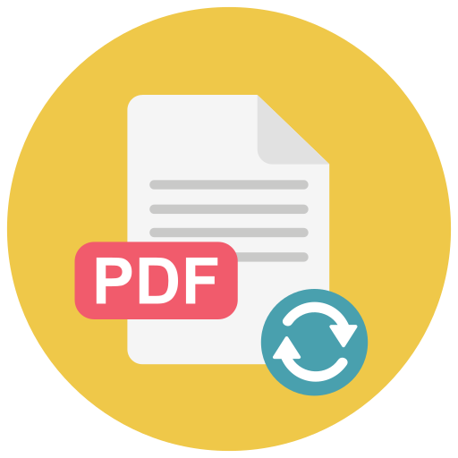
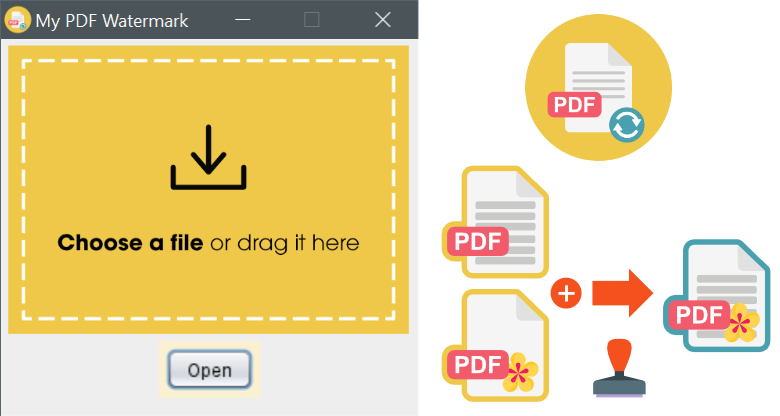

#  My PDF Watermark

Simple app which adds a background layer to a PDF.  
The background is loaded from a second PDF file.  
The converted PDF is saved as new file.  
Original files won't be overwritten.



## ⭐ Features
* Simple one-click UI
* Settings file for customization
* Runs independent on Win,Mac & Linux
* Console support for advanced users

## 💿 Download

📦 [MyPDFWatermark.zip](https://github.com/TobseF/My-PDF-Watermark/files/12325243/MyPDFWatermark.zip) 13,13 MB
> 💡 Requires an installed [Java JRE](https://adoptium.net/temurin/releases/).  
> Runs on Windows, Linux & Mac.


## 💡 Usage

To use the app, you need at least a Java 1.8 JRE.
You can get it for any platform [here](https://adoptium.net/temurin/releases/).

There are several ways to add a watermark to a PDF.

1. UI Drag & Drop
   Run the app without any arguments:
   ``` shell
   java -jar MyWatermark.jar my_document.pdf
   ```
   Windows users can use the provided `MyWatermark.exe` executable.
   Then move a file to the drop area.
2. UI Open File Dialog
   Just klick on the file drop area to select a PDF file.
3. Move A File onto the APP Shortcut
   Drag and move a PDF file onto the app shortcut.
4. Command Line Mode
   Run the app with command line and a path to a PDF file as argument:
    ``` shell
    java -jar MyWatermark.jar path/my_document.pdf
    ```

## 🛠 Configuration

Change settings in the `config.ini`:

```properties
# Can be an absolute path to the save location.
# Can be emtpy or `same`, to save to the location of the input file.
# Can be `desktop` which points to `USER_HOME/Desktop`.
save_path = same

# Name of the watermark PDF file, relative to the app directory.
watermark_file = Watermark.pdf

# New PDF file suffix, which will be appended to the converted file.
new_file_suffix = _w
```

## 🚀 Start from Source

To start the app within your IDE start the included run configuration:

* ▶ `PDFWatermark.xml`

Alternatively you can start the app with the [Gradle](https://gradle.org) command:

```shell
gradle run
```

This will start the application main class: `eu.tobse.tool.pdfwatermark.App`.  
(File: `app/src/main/java/eu/tobse/tool/pdfwatermark/App.java`)

## 🔨 Build Jar

To build a runnable jar with all dependencies, run
the [Gradle Shadow Plugin](https://imperceptiblethoughts.com/shadow/):

```shell
gradle shadowJar
```

The output file will be saved in: `build/libs/app-all.jar`.

## 🗂 Dependencies

All dependencies are included in the `app\lib` folder. No external maven or grade dependencies are needed.
Gradle will link them automatically. If you want to build the project without Gradle,
just add it as _dependencies_ folder in your IDE.

Under the hood it baked by [jPdf Tweak - Swiss Army Knife for PDF files](https://jpdftweak.sourceforge.io)
which uses [iText](https://github.com/itext).

## 📜 MIT Licence

Permission is hereby granted, free of charge, to any person obtaining a copy of this software and associated
documentation files (the "Software"), to deal in the Software without restriction, including without limitation
the rights to use, copy, modify, merge, publish, distribute, sublicense, and/or sell copies of the Software,
and to permit persons to whom the Software is furnished to do so.  
For details check: [LICENSE.md](LICENSE.md).  
Please respect the licences of the included dependencies:

* jPdf Tweak [Affero GNU Public License](https://www.gnu.org/licenses/agpl-3.0.en.html)
* IText 2.0 [MPL](https://www.gnu.org/licenses/lgpl-3.0.html.en#license-text) and
  [MPL](https://www.mozilla.org/en-US/MPL/2.0/FAQ/).  
  The original version is written by [Bruno Lowagie](https://lowagie.com/).
* BouncyCastle [MIT Like](https://www.bouncycastle.org/licence.html)  
  Copyright ©2000-2023 The [Legion Of The Bouncy Castle](http://www.bouncycastle.org)
* Commons Lang 3 [Apache License](https://www.apache.org/licenses/LICENSE-2.0)
* FileDrop - Robert Harder - [Public Domain](https://creativecommons.org/publicdomain/)

